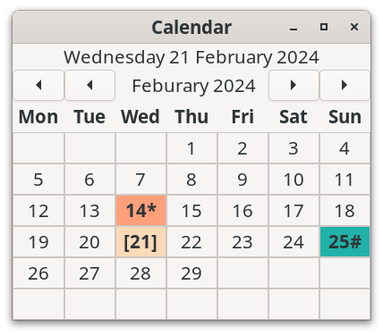

# GTK4 Simple Calendar

A simple GTK4 calendar which uses a grid of day labels for each month. It has been developed using C and [GTK4](https://docs.gtk.org/gtk4/).



GTK Simple Calendar does not use libAdwaita or css for styling. It uses Pango attributes and markup for adding some style and colour to the calendar. Pango is the text layout system used by GDK and GTK.

This is essentially the base calendar code use in my [Talk Calendar project](https://github.com/crispinprojects/talkcalendar).


## Core Features

* built with C and GTK 4.8.3 (Debian 12)
* uses a grid of day labels for each month
* buttons for changing month and year
* calendar visual colour marks for days with events and holidays
* go to current date (demonstrated by using home key)

## Prebuilt binary

A 64-bit prebuilt binary for the latest version of GTK4 simple Calendar is available and can be downloaded from the binary directory and can be used with Linux distributions that have GTK4 in their repositories such as Debian 12 Bookworm, Ubuntu 22.04, Fedora 35 onwards.

Extract the downloaded file which contains the Calendar executable. Assuming that the GTK4 base libraries are installed the Calendar binary can be run from the terminal using:

```
./calendar
```
or double click on the "calendar" file. The calendar file must have executable permissions to execute. Right click it and choose Properties->Permissions and tick allow "Executable as Program".

## Build From Source

The C source code for the Talk Calendar project is provided in the src directory.

[Geany](https://www.geany.org/) can be used as a source code editor for opening, viewing and then compiling the Calendar C code. Geany is lightweight and has an integrated terminal for building the application.

You need the GTK4 development libraries and the gcc compiler. The code has been compiled using GTK 4.8.3 amd64 (Debian 12 Bookworm). To determine which version of GTK4 is running on a Linux system use the following terminal command.

```
dpkg -l | grep libgtk*
```

With both  Debian Bookworm and Ubuntu and you need to install the following packages to compile GTK4 Simple Calendar.

```
apt install build-essential
apt install libgtk-4-dev

```

The package:

```
apt install libglib2.0-dev

```

is needed but should be installed by default when installing libgtk-4-dev.

Use the MAKEFILE to compile.

```
make
./calendar
```

### Building on Fedora

With Fedora you need to install the following packages to compile the Calendar.

```
sudo dnf install gtk4-devel
sudo dnf install gtk4-devel-docs
sudo dnf install glib-devel
```

## Using GTK4 Simple Calendar 

The main.c file demonstrates how the GTK4 Simple Calendar can be used.

A calendar is created as shown below.

```
calendar = custom_calendar_new();
```
To get the current selected day, month and year you use the following code.

```
int m_day = custom_calendar_get_day(CUSTOM_CALENDAR(calendar));
int m_month = custom_calendar_get_month(CUSTOM_CALENDAR(calendar));
int m_year = custom_calendar_get_year(CUSTOM_CALENDAR(calendar));

g_print("Date is : %d-%d-%d \n", m_day, m_month,m_year);
```

The following signals have been implemented

```
day-selected
next-month
prev-month
next-year
prev-year
```

An example of how to use these signal to connect call backs in the user program (see main.c) is shown below. 

```
g_signal_connect(CUSTOM_CALENDAR(calendar), "day-selected", G_CALLBACK(callbk_calendar_day_selected), label_date);
g_signal_connect(CUSTOM_CALENDAR(calendar), "next-month", G_CALLBACK(callbk_calendar_next_month), label_date);
g_signal_connect(CUSTOM_CALENDAR(calendar), "prev-month", G_CALLBACK(callbk_calendar_prev_month), label_date);
g_signal_connect(CUSTOM_CALENDAR(calendar), "next-year", G_CALLBACK(callbk_calendar_next_year), label_date);
g_signal_connect(CUSTOM_CALENDAR(calendar), "prev-year", G_CALLBACK(callbk_calendar_prev_year), label_date);
```
		
To add a visual colour mark for a day you use the following function.

```
custom_calendar_mark_day(CUSTOM_CALENDAR(calendar), 14);
```

In this example day 14 is marked on the calendar and could be a birthday for example. To reset all calendar marks you use the following function.

```
custom_calendar_reset_marks(CUSTOM_CALENDAR(calendar));
```
Typically you would use the reset marks function when moving between months and years before setting marks for the current month and year.

To add a visual colour mark for a holiday you use the function.

```
custom_calendar_mark_holiday(CUSTOM_CALENDAR(calendar),25);
```

In this example day 25 is marked as a holiday which would be Christmas day in December. Again you would typically reset all holiday visual marks when moving between months and years before setting holiday marks for the current month and year. To reset holiday marks use the function below.

```
custom_calendar_reset_holidays(CUSTOM_CALENDAR(calendar));
```

GTK4 Simple Claendar has properties which allow the colours for the current day, a marked day and a holiday can be changed as shown below.

```
g_object_set(calendar, "todaycolour", "red", NULL);
g_object_set(calendar, "eventcolour", "purple", NULL);
g_object_set(calendar, "holidaycolour", "darkgreen", NULL);
```

You use HTML colour names when changing colours. A list of HTML colour names can be found [here](https://www.w3schools.com/tags/ref_colornames.asp). Most of the major colour names have been implemented (not all tested) as shown below which should be sufficient if using either a dark or light legacy desktop colour scheme.

Red HTML colour names:
```
indianred 	
lightcoral 	
salmon 	
darksalmon 	
lightsalmon 	
crimson 	
red 	
firebrick 	
darkred 
```
Pink HTML colour names:
```
pink 	
lightpink 	
hotpink 	
deeppink 	
mediumvioletred 	
palevioletred
```
Orange HTML colour names:
```
lightsalmon 	
coral 	
tomato 	
orangered 
darkorange 
orange
```
Yellow HTML colour names:
```
gold 	
yellow 	
lightyellow 	
lemonchiffon 	
lightgoldenrodyellow 	
papayawhip 	
moccasin 	
peachpuff 	
palegoldenrod 	
khaki 	
darkkhaki 
```
Purple HTML colour names:
```
lavender 	
thistle 	
plum 	
violet 	
orchid 	
fuchsia 	
magenta 	
mediumorchid 	
mediumpurple 	
rebeccapurple 	
blueviolet 	
darkviolet 	
darkorchid 	
darkmagenta 	
purple 	
indigo 
slateblue 	
darkslateblue 
mediumslateblue
```
Green HTML colour names:
```
greenyellow 	
chartreuse 	
lawngreen 	
lime 	
limegreen 	
palegreen 	
lightgreen 	
mediumspringgreen 	
springgreen 	
mediumseagreen 
seagreen 	
forestgreen 
green 
darkgreen 
yellowgreen 
olivedrab 
olive 
darkolivegreen 	
mediumaquamarine 
darkseagreen 
lightseagreen
darkcyan 
teal 
```
Blue HTML colour names:
```
aqua 	
cyan 	
lightcyan 	
paleturquoise 	
aquamarine 	
turquoise 	
mediumturquoise 
darkturquoise 	
cadetblue 	
steelblue 	
lightsteelblue 	
powderblue 	
lightblue 	
skyblue 	
lightskyblue 	
deepskyblue 	
dodgerblue 	
cornflowerblue 	
mediumslateblue 
royalblue 	
blue 	
mediumblue 	
darkblue 
navy 	
midnightblue 
```
Brown HTML colour names:
```
cornsilk 	
blanchedalmond 	
bisque 
navajowhite 
wheat 	
burlywood 
tan 
rosybrown 
sandybrown 
goldenrod 
darkgoldenrod 
peru 
chocolate 
saddlebrown 
sienna 	
brown 	
maroon 
```
White HTML colour names:
```
white 	
snow 	
honeydew 	
mintcream 	
azure 	
aliceblue 	
ghostwhite 	
whitesmoke 
seashell 	
beige 	
oldlace 
floralwhite 	
ivory 	
antiquewhite 	
linen 
lavenderblush 	
mistyrose 
```
Grey HTML colour names:
```
gainsboro 	
lightgray 	
silver 	
darkgray 	
gray 	
dimgray 	
lightslategray 	
slategray 	
darkslategray 	
black 	
```
Note the American spelling of grey (gray).


To reset the calendar to the current day you use the following function.

```
custom_calendar_goto_today(CUSTOM_CALENDAR(calendar));
```

To update the calendar you use the following function.

```
custom_calendar_update(CUSTOM_CALENDAR(calendar));
```


##Testing

I have tested GKK4 Simple Calendar using  Debian 12 Xfce, Debian 12 Budgie and Debian 12 GNOME.


## Versioning

[SemVer](http://semver.org/) is used for versioning. The version number has the form 0.0.0 representing major, minor and bug fix changes.

## Author

* **Alan Crispin** [Github](https://github.com/crispinprojects)

## License

GTK4 Simple Calendar is licensed under LGPL v2.1. GTK is released under the terms of the LGPL v2.1 license.

## Project Status

Active.

I will add more features and improve the calendar as the project rolls along.

## Acknowledgements

* [GTK](https://www.gtk.org/)

* GTK is a free and open-source project maintained by GNOME and an active community of contributors. GTK is released under the terms of the [GNU Lesser General Public License version 2.1](https://www.gnu.org/licenses/old-licenses/lgpl-2.1.html).

* [GTK4 API](https://docs.gtk.org/gtk4/index.html)

* [GObject API](https://docs.gtk.org/gobject/index.html)

* [Geany](https://www.geany.org/) is a lightweight source-code editor (version 2 now uses GTK3). [GPL v2 license](https://www.gnu.org/licenses/old-licenses/gpl-2.0.txt)
